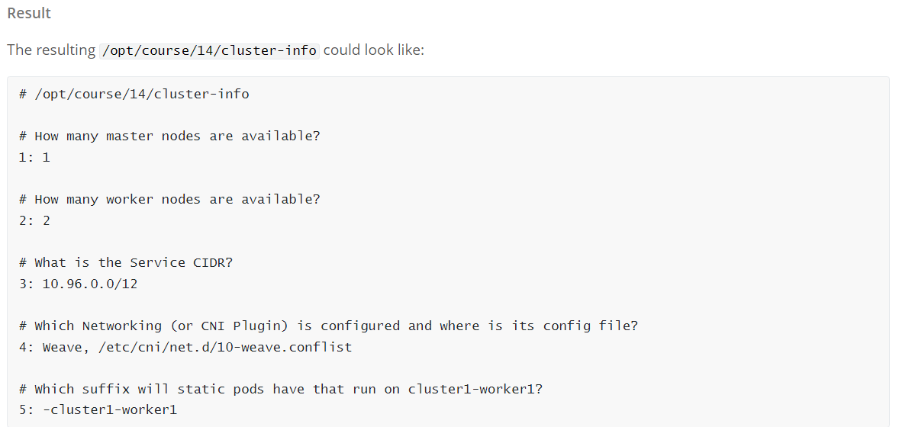
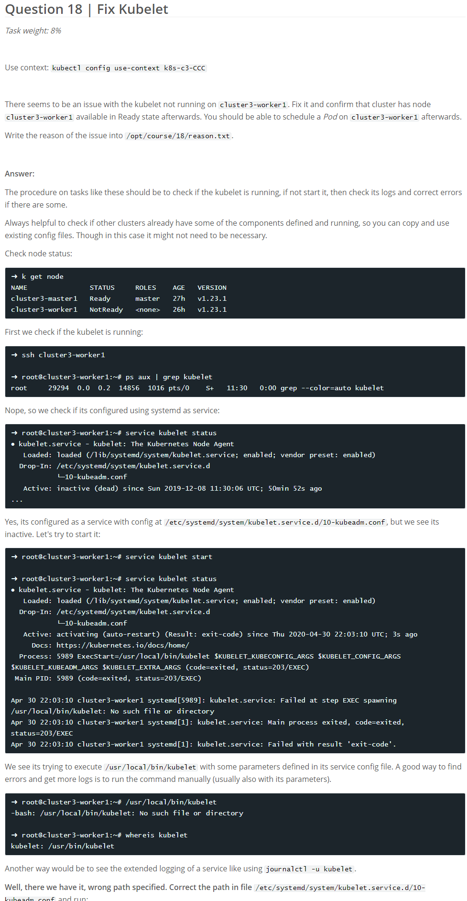

 Q1 | Contexts | 1% 

   
 

 Q2 | Schedule Pod on Master Node | 3% 

   
 

 Q3 | Scale down StatefulSet | 1% 

   
 

 Q4 | Pod Ready if Service is reachable | 4% 

   
 

 Q5 | Kubectl sorting | 1% 

   
 

 Q6 | Storage, PV, PVC, Pod volume | 8% 

   
 

 Q7 | Node and Pod Resource Usage | 1% 

   
 

 Q8 | Get Master Information | 2% 

    
 

 Q9 | Kill Scheduler, Manual Scheduling | 5% 

    
 

 Q10 | RBAC ServiceAccount Role RoleBinding | 6% 

   
 

 Q11 | DaemonSet on all Nodes | 4% 

   
 

 Q12 | Deployment on all Nodes | 6% 

    
 

 Q13 | Multi Containers and Pod shared Volume | 4% 

   
 

 Q14 | Find out Cluster Info | 2% 

   
 

 Q15 | Cluster Event Logging | 3% 

   
 

 Q16 | Namespaces and Api Resources | 2% 

   
 

 Q17 | Find Container of Pod and check info | 3% 

  
 

 Q18 | Fix Kubelet | 8% 

    
 

 Q19 | Create Secret and mount into Pod | 3% 

   
 

 Q20 | Update Kubernetes Version and join cluster | 10% 

   
 

 Q21 | Update Kubernetes Version and join cluster | 10% 

   
 

